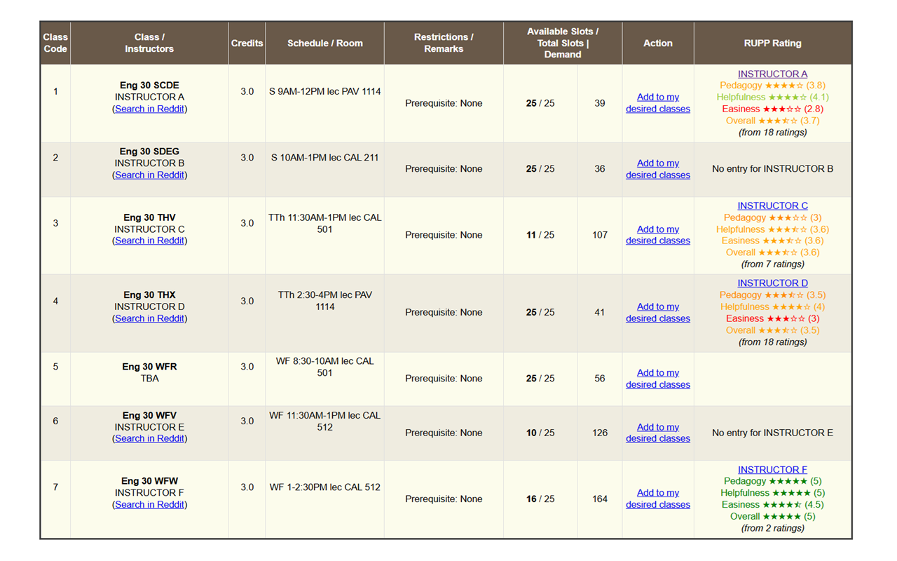

# CRS-RUPP Integration
This is a prototype for a browser extension which shows UPD instructors' new [RUPP](https://rupp.onrender.com/) rating in the [preenlistment](https://crs.upd.edu.ph/preenlistment/) and [waitlisting](https://crs.upd.edu.ph/student_registration/) modules of CRS.

Pull requests for improvements appreciated :)

## Features

- Adds a new column displaying an instructor's RUPP scores (helpfulness, pedagogy, easiness, and overall)
    - Appends a hyperlink to the instructor's RUPP page
    - Colour codes the ratings based on their value
    - Displays how many ratings the instructor has received
- Appends a Search Reddit link below their name which leads to their [r/RateUPProfs](https://www.reddit.com/r/RateUPProfs/) search results
- Includes support for multiple instructors in a block listing

Sample of what it looks like, with instructor names and class codes redacted.



# Installation

## Webstore

You may get it from the [Chrome Web Store](https://chromewebstore.google.com/detail/crs-rupp-integration/dinflpppeaghgnikookcbmckcklemnjl) for Chromium-based browsers.

> [!NOTE]
> The Chrome Webstore page is currently Unlisted; you will not be able to search for it.

## Manual Building

For non-Chromium-based browsers or if you want experimental updates, you may build the extension yourself using the instructions below.

### **Step 1.** Get a local copy.

Download the [latest release](https://github.com/Ulyzses/crs-rupp/releases) as a ZIP file and extract in your device.

Alternatively, you may use git clone to get experimental versions:

```
git clone https://github.com/Ulyzses/crs-rupp
```

### **Step 2.** Go to your browser's extension page.

You may visit the following URIs in your browser's address bar to go to the extension page:

- Arc: `arc://extensions/`
- Google Chrome: `chrome://extensions`
- Microsoft Edge: `edge://extensions`
- Firefox: `about:addons`
- Opera: `opera://extensions`

### **Step 3.** Activate Developer Mode.

Activating developer mode will allow you to load unpacked extensions.

### **Step 4.** Click "Load Unpacked" and select the folder where you extracted the repository.

If you used git clone, the folder should be named `crs-rupp`. Once you've finished this step, you should see the extension in your browser's extension page. This means you've successfully installed the extension.

# Usage

The extension should automatically be enabled when you visit a class search page in CRS (URLs of the form `https://crs.upd.edu.ph/*/class_search/*`). If it's still disabled, try refreshing the page.

When it detects the correct content, it should automatically load the instructors' information. However, if you are loading a class for the first time, there is a chance that this takes a few seconds while the extension fetches the available instructors from the RUPP database.

A new column will be added showing the RUPP scores of the instructor. Clicking on their name will lead you to their individual RUPP page.

If your instructor does not have any entry, that is unfortunately out of my scope. You may reach out to the developer of RUPP to have them added.

You may also click on the "Search in Reddit" button under their name on the left to open a new tab with the search results of the instructor's name in [r/RateUPProfs](https://reddit.com/r/RateUPProfs). This is usually a more reliable way as it is very active, particularly during the enlistment period.

Happy enlisting!

## Disclaimer

If you are a UPD student who finds this repository, feel free to use it at will. However, please take note of the following before proceeding:

- You assume all the risks in using this extension; I will not be responsible for the consequences of any use or misuse of this extension.
- The data found here is lifted from the new RUPP which is sparsely updated. As such, not everyone in the current roster of UPD intructors has a rating nor are they exactly accurate. Given that, the display of the RUPP scores should not be treated as the sole metric of an instructor's character.
- I am aware that there are other browser extensions that aim to improve CRS. I personally do not use them so I am yet to test this extension alongside them. If this breaks with them, please let me know.
- If you find this useful, you may share this to other people privately, but **do not post this on public resources or forums** (e.g. Facebook, Twitter, Reddit) to avoid intervention from the UPD Admin.
- This extension fetches data directly from the from RUPP database. To prevent redundant requests, the fetched information are stored locally with an expiry of 24 hours. If you are the developer of RUPP and would rather not have to deal with this additional traffic, you may contact me directly.

## Compatibility
- I cannot guarantee that this extension will work on your browser. It was developed and tested to be functional on the following browsers:
    - Chromium Engine Version 138
- If you've installed this extension and it works for you, *please open a pull request to edit this README to add or edit information regarding your browser*.